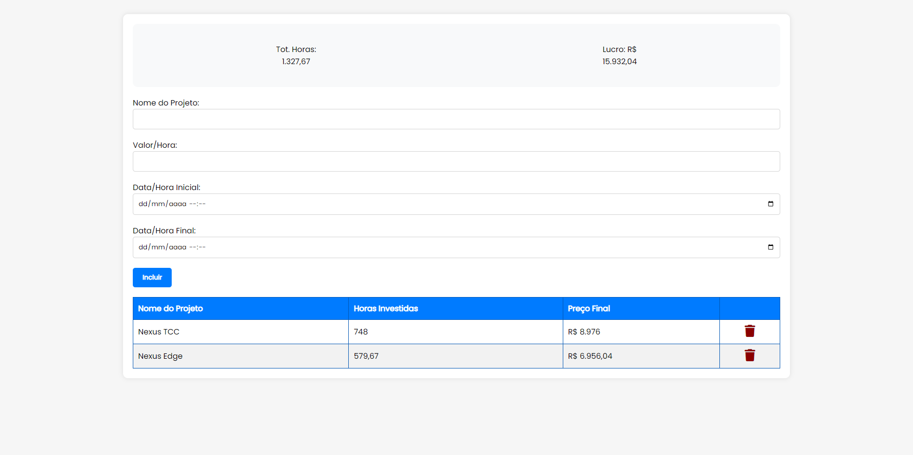

# Project Cost Calculator 📊



<p align="center">
  
  
  
</p>

🇧🇷 Você não fala inglês? [Clique aqui](README.pt.md) para ler a versão em português.

## 🚀 About the Project

The Project Cost Calculator is a simple yet powerful application that showcases the synergy of HTML, CSS, and JavaScript. It calculates the cost of projects based on hours worked and price per hour, providing an efficient way to track project profits.

One of the key features of this application is its use of the `localStorage`, which allows it to persist data across browser sessions. This means that your project data will still be there even if you close and reopen your browser!

## 🛠️ Technologies Used

- HTML
- CSS
- JavaScript

## ⚙️ Installation and Use

To install and use this project, follow these steps:

1. Clone this repository on your local machine
```bash
git clone https://github.com/artur-duart/project-cost-calculator
```
2. Navigate to the main folder of the project
```bash
cd project-cost-calculator
```
3. Open the `index.html` file in your browser

Now you can access the project in your browser.

## 🤝 Contributing

Contributions are always welcome! If you have any suggestions or corrections, feel free to open an issue or submit a pull request.

## 📝 License

This project is licensed under the MIT License. See the [LICENSE](LICENSE) file for more details.

---

Made with 💜 by <a href="https://www.linkedin.com/in/artur-duart/">Artur Duarte</a> :wave:
